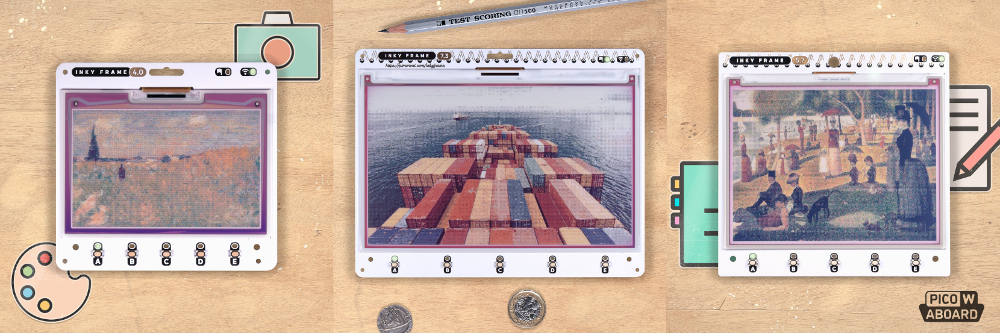

# Inky Frame

This repository is home to the MicroPython firmware and examples for
Inky Frame - a range of Pico-powered ePaper display boards.

## Download Firmware

There are two choices, a regular build that just updates the firmware on
your board and a "-with-examples" build which includes a ready-to-go set
of examples (everything in [examples/inkylauncher](examples/inkylauncher))
that you can interact with right on your display.

:warning: If you've changed any of the code on your board then back up before
flashing "-with-examples" - *your files will be erased!*

You can find the latest release at [https://github.com/pimoroni/inky-frame/releases/latest](https://github.com/pimoroni/inky-frame/releases/latest).

## Guides & Documentation

* [Getting Started With Inky Frame](https://learn.pimoroni.com/article/getting-started-with-inky-frame)
* [inky_frame Module Reference](docs/inky_frame.md)

## Get Inky Frame

* [Inky Frame 7.3"](https://shop.pimoroni.com/products/inky-frame-7-3?variant=40541882056787)
* [Inky Frame 5.7"](https://shop.pimoroni.com/products/inky-frame-5-7?variant=40057850331219)
* [Inky Frame 4.0"](https://shop.pimoroni.com/products/inky-frame-4?variant=40443825127507)